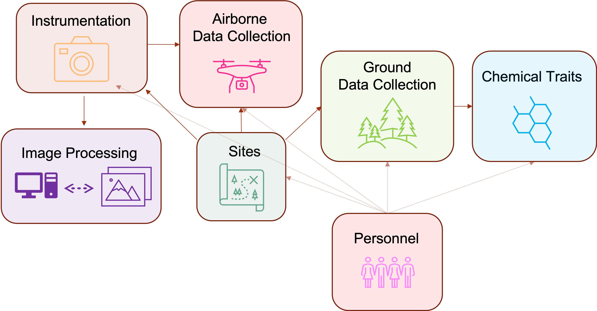
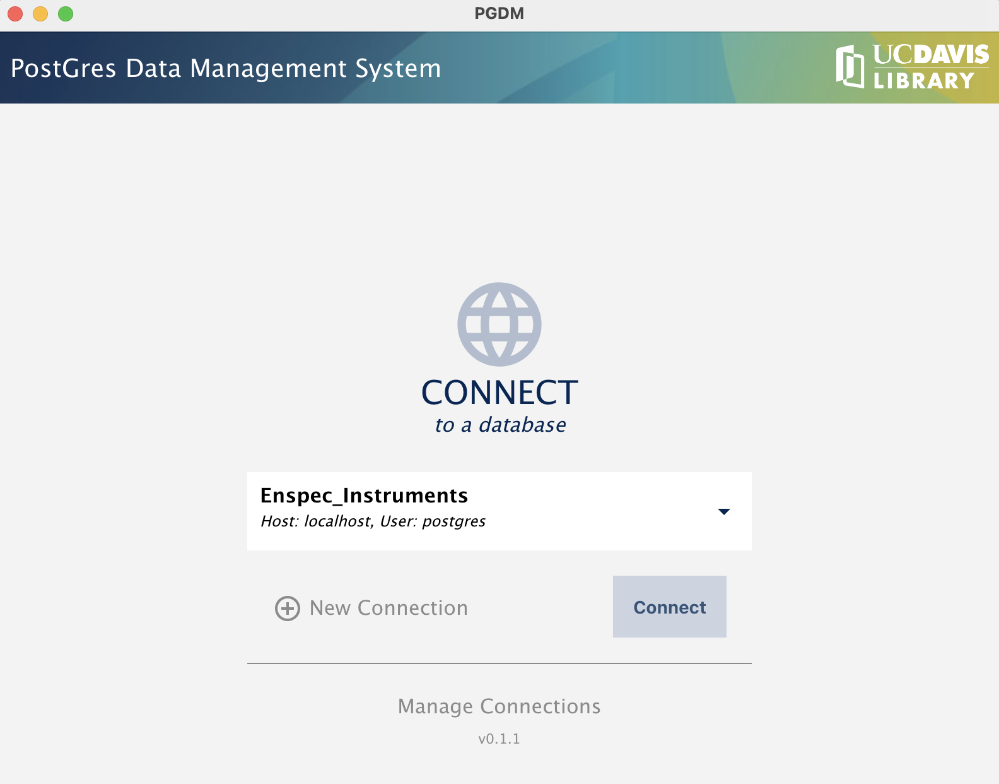
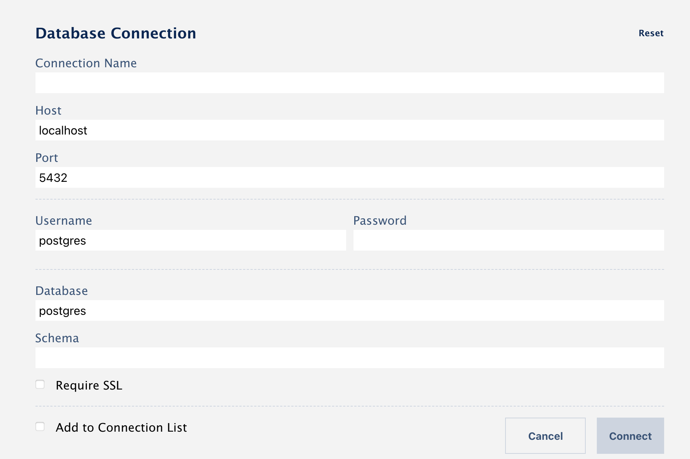
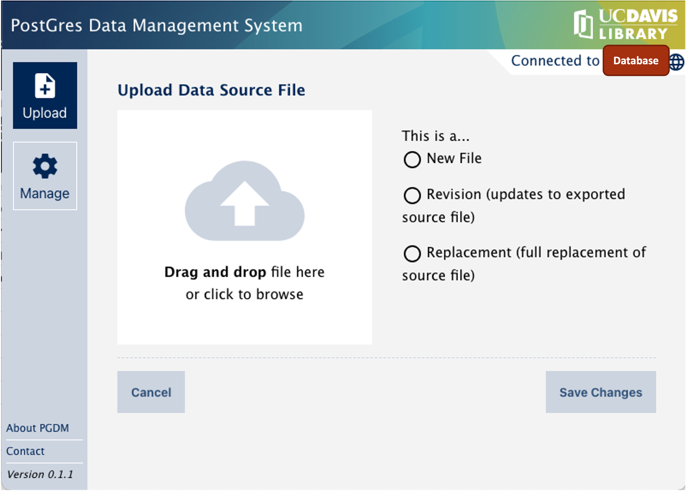

# UW EnSpec Database

`enspec-db-docker` is a docker container example to create database skeleton of the tables used in EnSpec lab
Instructions below show how to set up the docker and ways to interact with it.
The relationship between different tables is available in this [ERD diagram](images/EnSpec_Database_ERD.pdf).
The white-grey tables are primary while the yellow tables are bridge tables connecting them. The pink tables are primary tables which store lookup-table.

## Start the Docker
Install docker your device as the first step.
[Instructions for Mac](https://hub.docker.com/editions/community/docker-ce-desktop-mac), [Instructions for Windows](https://docs.docker.com/desktop/windows/install/)
After installing the docker, run the following commands on command prompt from the 'enspec-db-docker' folder:
```
cd docker/enspec-db-docker
docker-compose up
```

## Initialize database
Note: this will wipe the database!

Once you start the docker in the above step, the following steps will help you to interact with the database either directly in your command prompt using SQL commands or through [PGDM-UI](https://github.com/ucd-library/pgdm-ui). After designing the database ERD, the table templates were generated using [pgdm template builder](https://github.com/ucd-library/pgdm/blob/master/docs/template-builder.md). Hence, the tables will work with the PGDM-UI.

First, add the following to your ~/.pg_service.conf file
```
[enspec-db-docker]
host=localhost
port=5433
user=postgres
dbname=postgres
```

Then set pg service variable
```
export PGSERVICE=enspec-db-docker
```

Finally, run import script
```
cd schema
./init.sh
```

## Populate Database with Data
There are two ways to populate the tables:
1. Bulk upload using [PGDM](https://github.com/ucd-library/pgdm) tools OR using SQL queries
2. Use [PGDM-UI](https://github.com/ucd-library/pgdm-ui) and upload csv or excel files

In order to populate the database, upload the primary tables first and then connect information across primary tables using connected/bridge tables.
Templates for the tables are provided in `csv_templates` folder. They can be used for populating using the UI or just for quick look at the column names.

If populating the database using PGDM UI, here is a quick look at the UI:

- When opened, the UI looks like this (but with an empty drop down)


- Click on Manage Connections to add details. Don't forget to click on 'Add to Connection List' so that the connection appears in the drop down menu


- Press Connect and you can now upload your excel files in the database:


You can download the versioned tables after successful upload.
